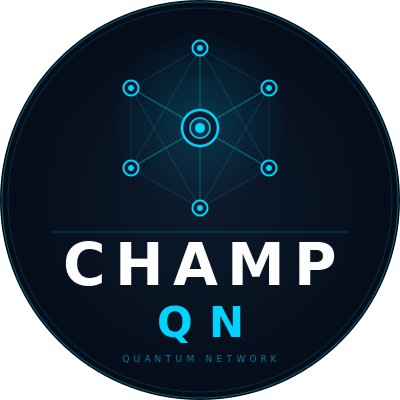
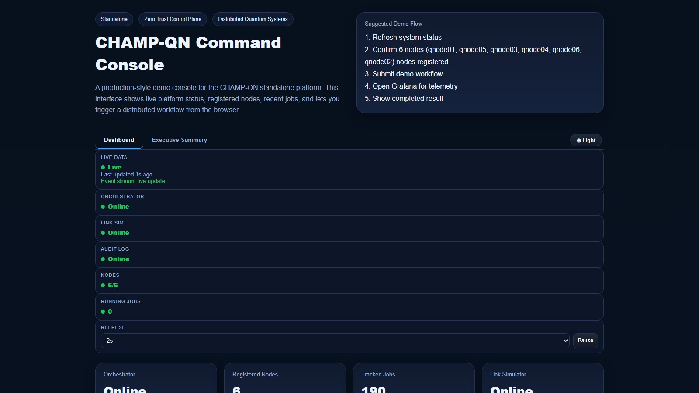
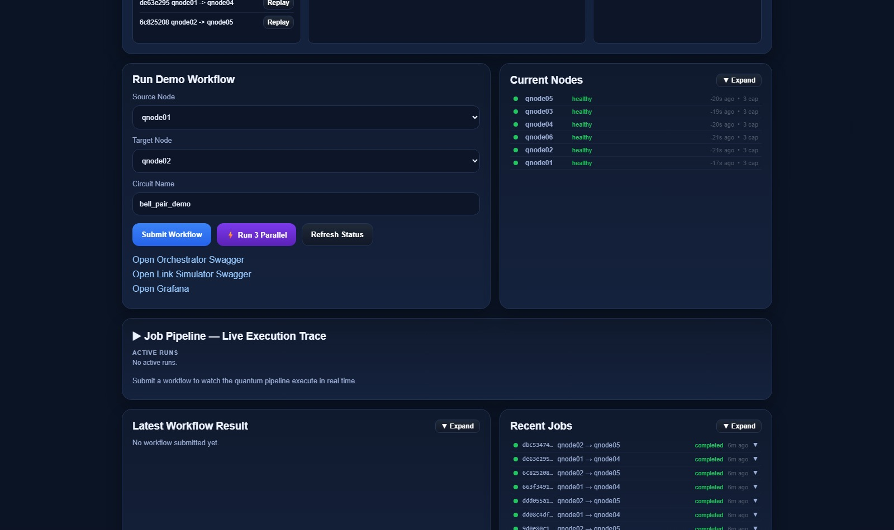
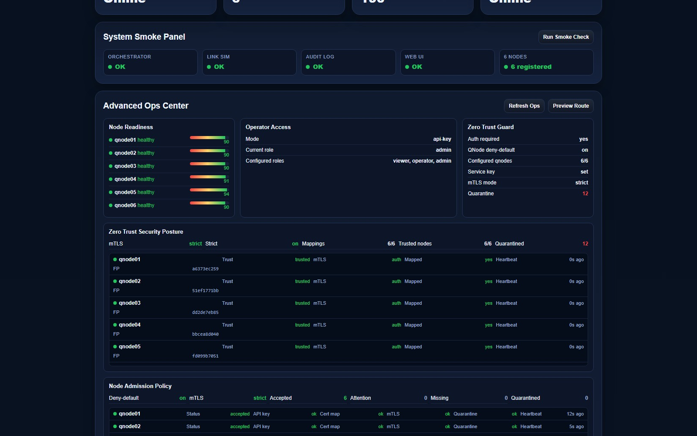
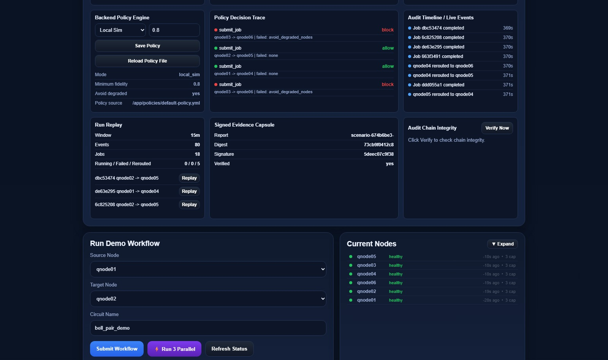
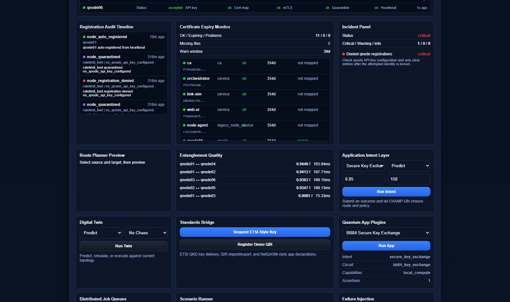
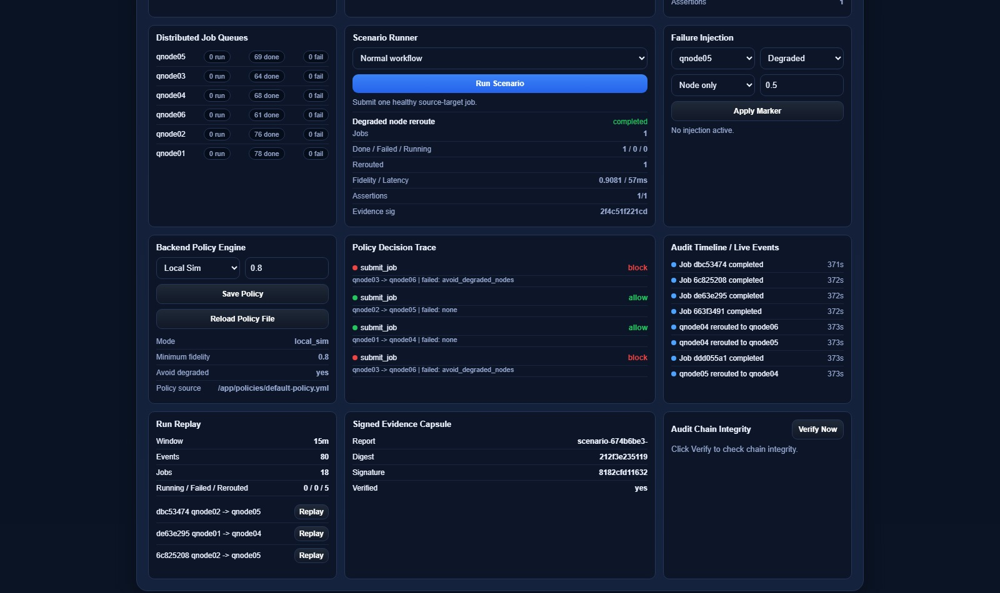
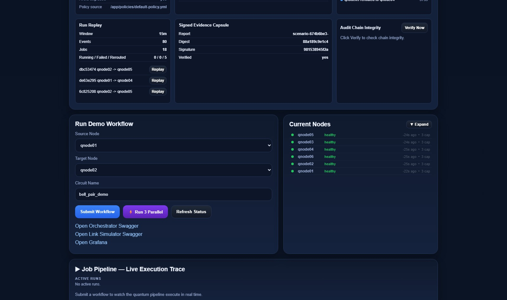
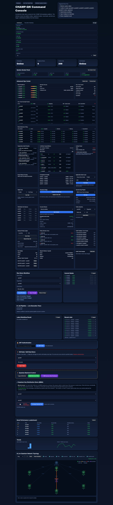

<p align="center">
  
</p>

<h1 align="center">CHAMP-QN</h1>
<p align="center"><strong>Zero Trust Control Plane for Distributed Quantum Networks</strong></p>

<p align="center">
  <a href="LICENSE"></a>
  
  
  
  
</p>

<p align="center">
  <em>Built by <a href="https://champtron-systems.com/">Champtron Systems LLC</a></em>
</p>

---

## Overview

Classical networking infrastructure cannot manage entanglement scheduling, fidelity-aware routing, or the cryptographic evidence chains required for quantum-safe compliance. CHAMP-QN fills that gap.

CHAMP-QN is a production-quality orchestration platform that enforces a Zero Trust security posture across every node, job, and key exchange in a distributed quantum network. It ships as a fully containerized 13-service stack — deployable in minutes, auditable by design.

---

## Core Capabilities

| Capability | Description |
|---|---|
| **Entanglement-aware routing** | Routes quantum workloads in real time based on live fidelity and latency measurements; automatically reroutes around degraded links |
| **BB84 Quantum Key Distribution** | End-to-end QKD with basis reconciliation, sifted key extraction, and visual proof of quantum key exchange |
| **Zero Trust control plane** | Every node authenticates via mTLS certificate fingerprint and API key on every request — no implicit trust, no exceptions |
| **Tamper-evident audit chain** | Every policy decision, job execution, and node registration is HMAC-SHA256 signed and chain-linked; deletion or reordering is immediately detectable |
| **Signed evidence capsules** | Each job produces a cryptographically signed proof-of-execution ready for compliance audits |
| **Live topology dashboard** | Real-time SVG network canvas with node health, fidelity/latency overlays, active job particles, and self-heal reroute visualization |
| **Policy engine** | Configurable fidelity thresholds, degraded node avoidance, and backend mode — with a per-decision audit trace |
| **Digital Twin Control Plane** | Intent-based scheduling, chaos injection, and scenario simulation without mutating live state |

---

## Architecture

```
┌─────────────────────────────────────────────────────────────┐
│                        Web Dashboard                         │
│         (real-time topology · job pipeline · audit)         │
└─────────────────────┬───────────────────────────────────────┘
                      │ HTTPS + JWT
┌─────────────────────▼───────────────────────────────────────┐
│                      Orchestrator                            │
│   job routing · policy engine · QKD · evidence capsules     │
│   mTLS node auth · audit log · SQLite · Prometheus metrics  │
└──────┬──────────────┬──────────────────────┬────────────────┘
       │ mTLS         │ mTLS                  │ mTLS
┌──────▼──────┐ ┌─────▼──────┐        ┌──────▼──────────────┐
│  Link Sim   │ │ Audit Log  │        │   Quantum Nodes      │
│ entanglement│ │ HMAC chain │        │  qnode01 – qnode06   │
│ fidelity/ms │ │ tamper-    │        │  Qiskit Aer / IBM Q  │
│             │ │ evident    │        │  local circuit exec  │
└─────────────┘ └────────────┘        └─────────────────────┘
                                       (6 independent agents)

Observability: Prometheus + Grafana (scraped from all services)
```

### Design Principles

| Principle | Implementation |
|---|---|
| Zero Trust | mTLS cert fingerprint + API key verified on every request — no session reuse |
| Audit-first | All decisions committed to the HMAC chain before acknowledgement |
| Fidelity-aware routing | Real-time rerouting around degraded links; every reroute logged and signed |
| Standards-aligned | ETSI QKD API bridge; QIR/NetQASM translation layer |
| Observable by default | Prometheus metrics on every service; pre-built Grafana dashboard |

---

## Dashboard

### System Health & Node Registry


### Node Registry & Live Job Pipeline

*All 6 quantum nodes registered and healthy. Live execution trace shows the 3-phase pipeline: Entanglement → Source Execution → Target Execution.*

### Zero Trust — Node Trust & Policy Posture


### Telemetry Event Stream & Policy Decision Trace

*Live audit timeline showing job completions, node reroutes, and per-request policy allow/block decisions with rule names.*

### AI-Assisted Anomaly Explanation & Certificate Monitor

*Incident panel, cert expiry monitor (11 certs tracked), entanglement quality matrix, and application intent prediction.*

### Policy Engine & Scenario Runner

*Hot-reload policy controls, failure injection, per-node job queue counters, and scenario runner with assertions.*

### Signed Evidence Capsule & Audit Chain Integrity

*Cryptographically signed proof-of-execution. Any tampered audit entry is detected immediately.*

### Full Dashboard


---

## Security

- Mutual TLS (mTLS) between all services — certificate fingerprint mapped per node
- JWT authentication with configurable expiry and login lockout
- Role-based access control — admin / operator / viewer
- HMAC-SHA256 signed audit log with chain-of-custody `prev_signature` linking
- Signed evidence capsules per job execution
- Maintenance mode and graceful shutdown

## Quantum Capabilities

- **BB84 QKD** — basis selection, measurement, reconciliation, and sifted key extraction with visual proof
- **Qiskit Aer** local quantum circuit simulation — switchable to IBM Quantum at runtime
- **6-node quantum cluster** — independent agents with heartbeat, auto-recovery, and capability reporting
- Fidelity range: 0.88–0.99 | Latency range: 35–180 ms | Link success rate: 95% (all configurable)

## Observability & Operations

- Prometheus metrics on every service (attempts, success, latency histograms)
- Pre-built Grafana dashboard and live WebSocket event stream to the browser dashboard
- **Failure injection** — mark a node degraded at a configurable severity level; policy engine reacts immediately
- **Scenario runner** — preset scenarios (degraded node reroute, parallel load, BB84 demo) with assertion verification
- **Topology replay** — 15-minute rolling replay window with per-job timeline
- **Hot-reload policy** — update routing policy at runtime without container restart
- **Digital twin** — predict chaos outcomes without mutating live state

---

## Technology Stack

| Layer | Technology |
|---|---|
| Orchestrator | Python 3.12, FastAPI, SQLite, asyncio |
| Node Agents | Python 3.12, FastAPI, Qiskit Aer |
| Link Simulator | Python 3.12, FastAPI |
| Audit Log | Python 3.12, FastAPI, HMAC-SHA256 chain |
| Web Dashboard | Vanilla JS, SVG topology canvas |
| Observability | Prometheus, Grafana |
| Transport Security | mTLS (mutual TLS), self-signed CA |
| Container Runtime | Docker Compose (13-service stack) |
| Quantum Backends | Qiskit Aer (local) · IBM Quantum (optional) |

---

## NVIDIA Inception Program

**Champtron Systems LLC is a member of the NVIDIA Inception Program.**

NVIDIA Inception nurtures startups revolutionizing industries with technology advancements. Membership does not imply endorsement, certification, or funding by NVIDIA.

### GPU Acceleration Roadmap

| Technology | Planned Application |
|---|---|
| **CUDA / cuQuantum** | GPU-accelerated quantum circuit execution — replace Qiskit Aer CPU simulator for high-fidelity multi-qubit entanglement modeling at scale |
| **CUDA-Q** | Port node-agent circuit execution to hybrid classical-quantum workloads on NVIDIA GPUs |
| **RAPIDS** | GPU-accelerated telemetry analytics and entanglement quality time-series processing |
| **TensorRT / Triton** | Accelerated inference for anomaly detection models on live quantum network event streams |
| **NVIDIA NIM** | AI microservices for real-time policy recommendation and intent prediction in the orchestrator |
| **NVIDIA AI Enterprise** | Production-grade AI runtime for zero trust decision support and audit chain analysis |
| **Jetson Edge AI** | Lightweight quantum node agents on Jetson platforms for field-deployable quantum network nodes |

---

## Project Status

| Component | Status |
|---|---|
| Core orchestration | Production-ready demo |
| Zero Trust auth — mTLS + JWT + RBAC | Complete |
| BB84 QKD | Complete |
| Tamper-evident audit chain | Complete |
| Prometheus + Grafana observability | Complete |
| Signed evidence capsules | Complete |
| IBM Quantum integration | Optional — bring your own API key |
| cuQuantum / CUDA-Q integration | Roadmap |
| Multi-tenant / cloud deployment | Roadmap |

---

## Contact & Access

This repository contains the public product overview. Source code is available under a private research license.

To request access, schedule a demo, or discuss a partnership:

**Carnell Smith — Champtron Systems LLC**
[carnell.smith@champtron-systems.com](mailto:carnell.smith@champtron-systems.com)

---

## License

Public documentation and screenshots in this repository are licensed under [MIT](LICENSE).
Source code is proprietary and not included in this repository.
