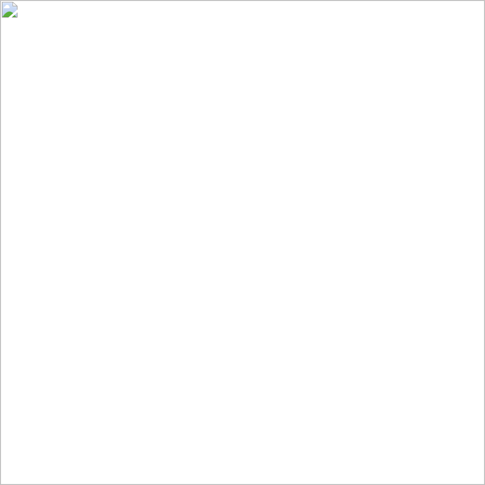

<p align="center">
  
</p>

# CHAMP-QN

**Zero Trust Control Plane for Distributed Quantum Networks**

[](LICENSE)


> **Champtron Systems LLC is a member of the NVIDIA Inception Program.**

> CHAMP-QN is a production-quality quantum network orchestration platform that implements Zero Trust security for distributed quantum infrastructure — 6-node quantum cluster, BB84 QKD, real-time topology, mTLS, and a tamper-evident audit chain.

---

## The Problem

Quantum networks require a new class of control infrastructure. Classical networking tools cannot manage entanglement scheduling, fidelity-aware routing, or the cryptographic evidence chains needed for quantum-safe compliance. There is no production-ready Zero Trust control plane for distributed quantum nodes — until now.

---

## What CHAMP-QN Does

CHAMP-QN orchestrates a distributed quantum network and enforces a Zero Trust security posture across every node, job, and key exchange:

- **Entanglement-aware job routing** — routes quantum workloads across nodes based on real-time fidelity and latency measurements, automatically rerouting around degraded links
- **BB84 Quantum Key Distribution** — end-to-end QKD implementation with basis reconciliation, sifted key extraction, and visual proof of quantum key exchange
- **Zero Trust control plane** — every node must authenticate via mTLS certificate fingerprint and API key before any job is dispatched; no implicit trust
- **Tamper-evident audit chain** — every policy decision, job execution, and node registration is HMAC-SHA256 signed and chain-linked; any deletion or reordering is immediately detectable
- **Signed evidence capsules** — each job produces a cryptographically signed proof-of-execution suitable for compliance audits
- **Live topology dashboard** — real-time SVG network canvas showing node health, entanglement fidelity/latency overlays, active job particles, and self-heal reroute visualization
- **Policy engine** — configurable routing policy (fidelity threshold, degraded node avoidance, backend mode) with per-decision audit trace
- **Digital Twin Control Plane** — intent-based scheduling, chaos engineering, and scenario simulation without mutating production state

---

## Architecture

```
┌─────────────────────────────────────────────────────────────┐
│                        Web Dashboard                         │
│         (real-time topology · job pipeline · audit)         │
└─────────────────────┬───────────────────────────────────────┘
                      │ HTTPS + JWT
┌─────────────────────▼───────────────────────────────────────┐
│                      Orchestrator                            │
│   job routing · policy engine · QKD · evidence capsules     │
│   mTLS node auth · audit log · DB · Prometheus metrics      │
└──────┬──────────────┬──────────────────────┬────────────────┘
       │ mTLS         │ mTLS                  │ mTLS
┌──────▼──────┐ ┌─────▼──────┐        ┌──────▼──────────────┐
│  Link Sim   │ │ Audit Log  │        │   Quantum Nodes      │
│ entanglement│ │ HMAC chain │        │  qnode01 – qnode06   │
│ fidelity/ms │ │ tamper-    │        │  Qiskit Aer / IBM Q  │
│             │ │ evident    │        │  local circuit exec  │
└─────────────┘ └────────────┘        └─────────────────────┘
                                       (6 independent agents)

Observability: Prometheus + Grafana (scraped from all services)
```

### Key Design Principles

| Principle | Implementation |
|-----------|---------------|
| Zero Trust | Every node authenticates via mTLS cert fingerprint + API key on every request |
| Audit-first | All decisions written to tamper-evident HMAC chain before acknowledgement |
| Fidelity-aware routing | Jobs route around degraded links in real time; rerouting logged and signed |
| Standards-aligned | ETSI QKD API bridge, QIR/NetQASM translation layer |
| Observable by default | Prometheus metrics on every service; Grafana dashboard pre-built |

---

## Dashboard

### Overview — System Health & Node Registry


### Node Registry & Live Job Pipeline

*All 6 quantum nodes registered and healthy. Live execution trace shows 3-phase pipeline: Entanglement → Source Execution → Target Execution.*

### Zero Trust — Node Trust & Policy Posture


### Telemetry Event Stream & Policy Decision Trace

*Live audit timeline showing job completions, node reroutes, and per-request policy allow/block decisions with rule names.*

### AI-Assisted Anomaly Explanation & Certificate Monitor

*Incident panel, cert expiry monitor (11 certs tracked), entanglement quality matrix, and application intent prediction.*

### Policy Engine & Scenario Runner

*Hot-reload policy controls, failure injection, per-node job queue counters, and scenario runner with assertions.*

### Signed Evidence Capsule & Audit Chain Integrity

*Cryptographically signed proof-of-execution. Audit chain verification — any tampered entry is detected immediately.*

### Full Dashboard Top


---

## Feature Highlights

### Security
- Mutual TLS (mTLS) between all services — cert fingerprint mapped per node
- JWT authentication with configurable expiry and login lockout
- Role-based access control (admin / operator / viewer)
- HMAC-SHA256 signed audit log with chain-of-custody (prev_signature linking)
- Signed evidence capsules per job execution
- Maintenance mode and graceful shutdown

### Quantum Capabilities
- **BB84 QKD** — basis selection, measurement, basis reconciliation, sifted key extraction, visual proof
- **Qiskit Aer** local quantum circuit simulation (switchable to IBM Quantum at runtime)
- **6-node quantum cluster** — independent agents with heartbeat, auto-recovery, and capability reporting
- Fidelity range: 0.88–0.99 | Latency range: 35–180ms (configurable)
- Link success rate: 95% (configurable)

### Observability
- Prometheus metrics on every service (attempts, success, latency histograms)
- Pre-built Grafana dashboard
- Live WebSocket event stream to the browser dashboard
- Per-node health scoring and readiness assessment
- Entanglement quality matrix with real-time fidelity/latency per node pair

### Operations
- **Failure injection** — mark a node as degraded at a configurable level; policy engine reacts immediately
- **Scenario runner** — preset scenarios (degraded node reroute, parallel load, BB84 demo) with assertion verification
- **Topology replay** — 15-minute rolling replay window with per-job timeline
- **Hot-reload policy** — update routing policy at runtime without container restart
- **Digital twin** — simulate chaos and predict outcomes without mutating live state

---

## Technology Stack

| Layer | Technology |
|-------|-----------|
| Orchestrator | Python 3.12, FastAPI, SQLite, asyncio |
| Node Agents | Python 3.12, FastAPI, Qiskit Aer |
| Link Simulator | Python 3.12, FastAPI |
| Audit Log | Python 3.12, FastAPI, HMAC-SHA256 chain |
| Web Dashboard | Vanilla JS, SVG topology canvas |
| Observability | Prometheus, Grafana |
| Transport Security | mTLS (mutual TLS), self-signed CA |
| Container Runtime | Docker Compose (13-service stack) |
| Quantum Backends | Qiskit Aer (local) · IBM Quantum (optional) |

---

## NVIDIA Inception Program

**Champtron Systems LLC is a member of the NVIDIA Inception Program.**

> NVIDIA Inception is a program designed to nurture startups revolutionizing industries with technology advancements. Membership does not imply endorsement, certification, or funding by NVIDIA.

---

## NVIDIA Acceleration Roadmap

CHAMP-QN plans to evaluate NVIDIA GPUs and NVIDIA AI software for accelerated quantum simulation, telemetry analysis, anomaly detection, and AI-assisted operational decision support.

| Candidate Technology | Planned Application |
|---|---|
| **CUDA / cuQuantum** | Replace Qiskit Aer CPU simulator with GPU-accelerated quantum circuit execution for high-fidelity multi-qubit entanglement modeling at scale |
| **CUDA-Q (CUDA Quantum)** | Port node-agent circuit execution to hybrid classical-quantum workloads on NVIDIA GPUs |
| **RAPIDS** | GPU-accelerated telemetry analytics and entanglement quality time-series processing |
| **TensorRT / Triton Inference Server** | Accelerated inference for anomaly detection models on live quantum network event streams |
| **NVIDIA NIM** | AI microservices for real-time policy recommendation and intent prediction in the orchestrator |
| **NVIDIA AI Enterprise** | Production-grade AI runtime for zero trust decision support and audit chain analysis |
| **Jetson (Edge AI)** | Deploy lightweight quantum node agents to Jetson edge platforms for field-deployable quantum network nodes |

---

## Project Status

| Item | Status |
|------|--------|
| Core orchestration | Production-ready demo |
| Zero Trust auth (mTLS + JWT + RBAC) | Complete |
| BB84 QKD | Complete |
| Tamper-evident audit chain | Complete |
| Prometheus + Grafana | Complete |
| Signed evidence capsules | Complete |
| IBM Quantum integration | Optional (bring your own API key) |
| cuQuantum / CUDA-Q integration | Roadmap |
| Multi-tenant / cloud deployment | Roadmap |

---

## Contact & Access

This repository contains the public product overview. Source code is available under a private research license.

To request access, a demo, or a partnership discussion:

**Carnell Smith**
carnell.smith@champtron-systems.com

---

## License

Public documentation and screenshots in this repository are licensed under [MIT](LICENSE).
Source code is proprietary and not included in this repository.
